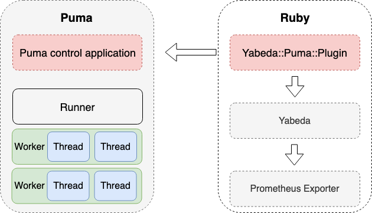
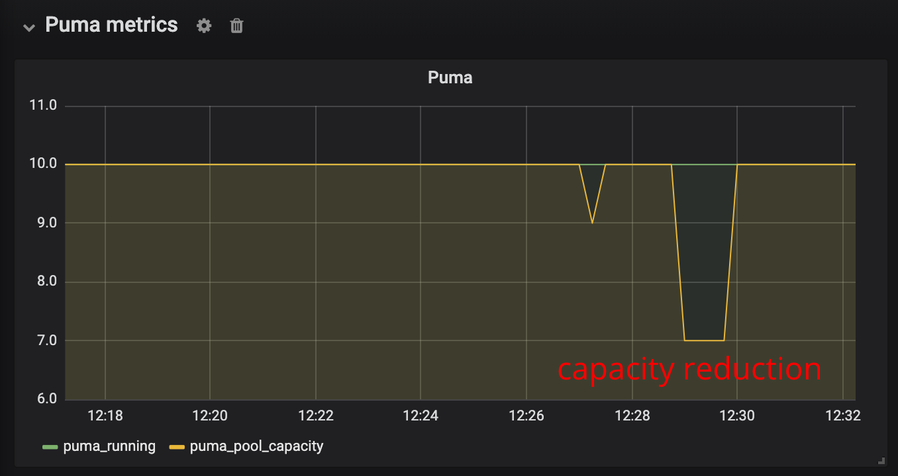

<a href="https://amplifr.com/?utm_source=yabeda-puma-plugin">
  
</a>

# Yabeda::Puma::Plugin

Built-in metrics for [Puma](https://github.com/puma/puma) web server monitoring out of the box! Part of the [yabeda](https://github.com/yabeda-rb/yabeda) suite.

## Metrics

Works as the Puma plugin and provides following metrics:
 - `puma_workers` - the number of running puma workers
 - `puma_booted_workers` - the number of booted puma workers
 - `puma_old_workers` - the number of old puma worker

Segmented by the worker (index of the worker):
 - `puma_pool_capacity` - the capacity of each worker: the number of requests that the server is capable of taking right now. More details are [here](https://github.com/puma/puma/blob/0f8b10737e36fc24cdd572f76a739659b5fad9cb/lib/puma/server.rb#L167).
 - `puma_running` - the number of running threads (spawned threads) for any puma worker
 - `puma_max_threads` - preconfigured maximum number of worker threads
 - `puma_backlog` - the number of backlog threads, the number of connections in that worker's "todo" set waiting for a worker thread.

## Installation

Add this line to your application's Gemfile:

```ruby
gem 'yabeda-puma'
```

And then execute:

    $ bundle

## Usage

Add those 2 lines of code to your `config/puma.rb` file:
```ruby
activate_control_app
plugin :yabeda
```
It will activate default puma control application working over the unix socket, and runs the `yabeda` puma plugin, for registering and collecting the metrics.

## Details

In accordance with the [architecture](https://github.com/puma/puma/blob/master/docs/architecture.md) of the puma web server lets look how it works:

.


For the configuration above, we will have the list of metrics (with help of `yabeda-prometheus` exporter):
```
GET /metrics

puma_backlog{index="0"} 0
puma_backlog{index="1"} 0
puma_running{index="0"} 5
puma_running{index="1"} 5
puma_pool_capacity{index="0"} 1
puma_pool_capacity{index="1"} 5
puma_max_threads{index="0"} 5
puma_max_threads{index="1"} 5
puma_workers 2
puma_booted_workers 2
puma_old_workers 0
```

See also the grafana screenshot of monitoring puma pool size and it's capacity when application is overloaded:

.


## Roadmap (TODO or Help wanted)

- Collect also `control-gc` puma metrics

## Development with Docker

Get local development environment working and tests running is very easy with docker-compose:
```bash
docker-compose run app bundle
docker-compose run app bundle exec rspec
```

## Contributing

Bug reports and pull requests are welcome on GitHub at https://github.com/[USERNAME]/yabeda-puma.

## License

The gem is available as open source under the terms of the [MIT License](https://opensource.org/licenses/MIT).
